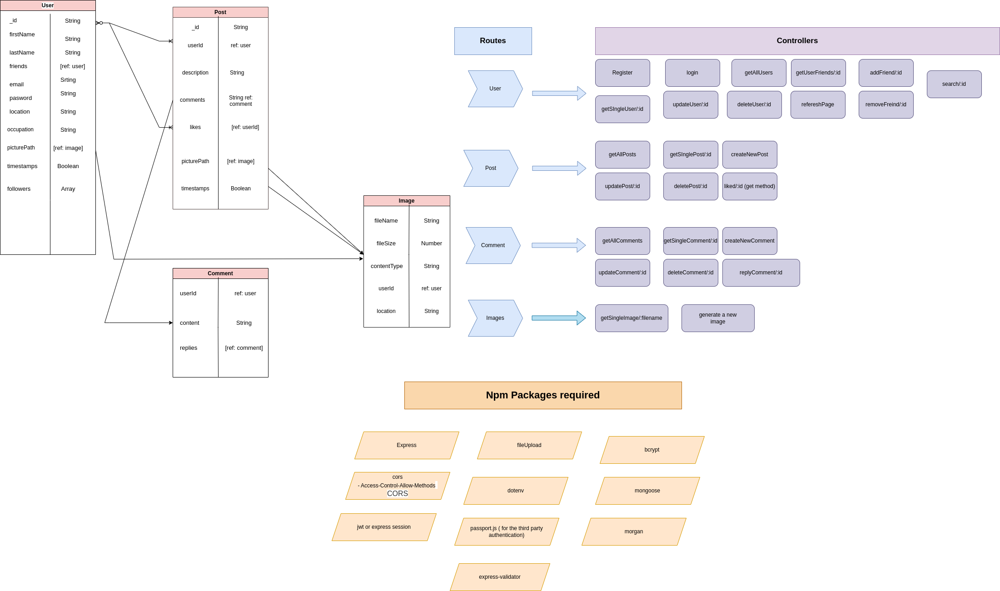

# FriendFusion

<table>
  <tbody>
    <tr>
      <td colspan="2">Architecture Flowchart</td>
    </tr>
    <tr>
      <td>
      
      </td>
    </tr>
    <tr>
      <td colspan="2">Figma Flowchart</td>
    </tr>
      <td>
        
      </td>
  </tbody>
</table>

# Friendfusion Architecture

## About

FriendFusion is a social media app built using JavaScript for full-stack development. It aims to provide a comprehensive solution for managing various aspects of a social media platform, including user interface, data storage, authentication, and communication. The app leverages popular technologies and libraries to create a seamless and engaging user experience.

The client-side of FriendFusion is built using the following technologies:

-   Client

    -   React: A UI component structure library for building interactive user interfaces.
    -   React Router DOM: Enables frontend routing for navigating between different pages in the app.
    -   Tailwind CSS: A utility-first CSS framework for designing modern and responsive interfaces.
    -   Date-fns: A JavaScript date utility library for formatting and manipulating dates.
    -   Linkify-react: Adds clickable links to text, enabling URL detection and conversion.
    -   React-input-emoji: Allows users to add emojis to their posts and messages.
    -   Yet Another React Lightbox: Enables a lightbox effect for viewing images in a gallery.
    -   Formspree: Integrates a feedback form for users to submit their suggestions or issues.

-   Server

-   The server-side of FriendFusion is built using the following technologies:

    -   Node.js: A JavaScript runtime environment for executing server-side code.
    -   Express.js: A web application framework for building APIs and handling HTTP requests.
    -   MongoDB/Atlas: A NoSQL database for storing and managing user data.
    -   Mongoose: An Object Data Modeling (ODM) library for MongoDB, providing a convenient way to interact with the database.
    -   JWT: JSON Web Tokens are used for authentication and secure communication between the client and server.
    -   Cloudinary: An image and video hosting service for storing and managing multimedia content.
    -   Nodemailer: A module for sending emails, used for various purposes like account verification and notifications.
    -   Swagger: A tool for designing, building, and documenting APIs.

## Core Structure

    Friendfusion
      ├── server
      │   ├── api
      │   │   > NodeJS
      │   │   > PORT 4000
      │   │   > api.example.com
      │   │
      │   ├── database
      │       > MongoDB
      │       > PORT 4000
      │
      │
      │
      ├── client
      │   │
      │   └── Website
      │       > React/vite
      │       > Single page application
      │       > PORT 5173
      │       > example.com
      │
      └── README.md (you are here)

## Stack

### Client

-   Web
    -   React
    -   React Router DOM
    -   Tailwind CSS
    -   Axios
    -   Date-fns
    -   Linkify-react
    -   OpenAI
    -   React-input-emoji
    -   Yet Another React Lightbox
    -   Formspree

### Server

-   API
    -   Node.js
    -   Express.js
    -   MongoDB/Atlas
    -   Mongoose
    -   JWT
    -   Cloudinary
    -   Nodemailer
    -   Swagger

## Setup and Running

-   To set up and run FriendFusion locally, make sure you have the following prerequisites installed:

    -   Node (`v18.3.0`)
    -   MongoDB (`v4.0.28`)

-   Clone repository `git clone git@github.com:dolce-emmy/FriendFusion.git fullstack`

-   **API**

    ## API

The server-side of FriendFusion utilizes an API built with the following technologies:

-   Node.js: A JavaScript runtime environment for executing server-side code.
-   Express.js: A web application framework for building APIs and handling HTTP requests.
-   MongoDB/Atlas: A NoSQL database for storing and managing user data.
-   Mongoose: An Object Data Modeling (ODM) library for MongoDB, providing a convenient way to interact with the database.
-   JWT: JSON Web Tokens are used for authentication and secure communication between the client and server.
-   Cloudinary: An image and video hosting service for storing and managing multimedia content.
-   Nodemailer: A module for sending emails, used for various purposes like account verification and notifications.
-   Swagger: A tool for designing, building, and documenting APIs.

### Setup and Running

To set up and run the API server for FriendFusion locally, follow these steps:

1. Switch to the `api` directory: `cd server`
2. Configuration
    - Create a local environment file: `cp .env.dev.example .env.local`
    - Modify the `.env.local` file with the following settings:
        - `PORT`: The port number for the API server (e.g., `4000`)
        - `MONGODB_URI`: The URI for connecting to your MongoDB database (e.g., `mongodb+srv://<username>:<password>@<cluster-url>/<database-name>`)
        - `JWT_SECRET`: A secret key for JWT token generation (use a secure and unique value)
        - `CLOUDINARY_CLOUD_NAME`, `CLOUDINARY_API_KEY`, `CLOUDINARY_API_SECRET`: Cloudinary credentials for storing multimedia content
        - `EMAIL`: Your email address for sending emails
        - `PASSWORD`: Your password for the specified email address
3. Setup
    - Install packages and seed the database: `npm run setup`
4. Run
    - Start the API server: `npm start` (http://localhost:4000)

## Screenshots

View all screenshots [here](https://github.com/dolce-emmy/FriendFusion/tree/main/client/public).

<table>
  <tbody>
    <tr>
      <td colspan="2">Login</td>
    </tr>
    <tr>1. Switch to the `api` directory: `cd server`
2. Configuration
   - Create a local environment file: `cp .env.dev.example .env.local`
   - Modify the `.env.local` file with the following settings:
     - `PORT`: The port number for the API server (e.g., `4000`)
     - `MONGODB_URI`: The URI for connecting to your MongoDB database (e.g., `mongodb+srv://<username>:<password>@<cluster-url>/<database-name>`)
     - `JWT_SECRET`: A secret key for JWT token generation (use a secure and unique value)
     - `CLOUDINARY_CLOUD_NAME`, `CLOUDINARY_API_KEY`, `CLOUDINARY_API_SECRET`: Cloudinary credentials for storing multimedia content
     - `EMAIL`: Your email address for sending emails
     - `PASSWORD`: Your password for the specified email address
3. Setup
   - Install packages and seed the database: `npm run setup`
4. Run
   - Start the API server: `npm start` (http://localhost:4000)
      <td>
        
      </td>
      <td>
        
      </td>
    </tr>
    <tr>
      <td colspan="2">Web</td>
    </tr>
    <tr>
      <td>
        
      </td>
      <td>
        
      </td>
    </tr>
    <tr>
      <td colspan="2">Profile</td>
    </tr>
    <tr>
      <td>
        
      </td>
      <td>
        
      </td>
    </tr>

  </tbody>
</table>

## Authors

-   Rama Bindu, Christiana Jones, Peter Okafor, Eman Yassin, Mohammed Al-shameri - [GitHub](https://github.com/dolce-emmy/FriendFusion) ·
